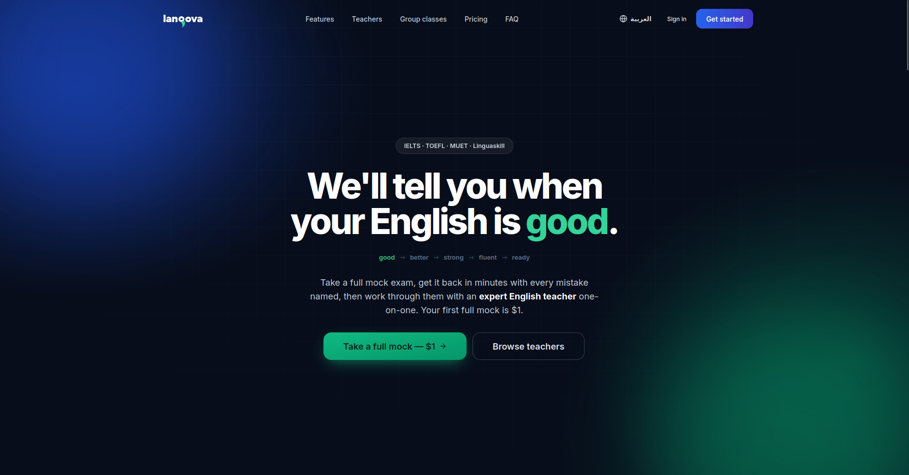

# Langova

A full-stack ed-tech platform for English exam prep (IELTS, TOEFL, MUET, Linguaskill): mock exams with automatic grading, live tutor sessions, group classes, e-learning courses and subscriptions, with the admin tooling to run it.

**Live:** [langovaprep.com](https://langovaprep.com)

> **The source code is private.** This repository is a showcase of what Langova is and how it is built. It contains no application code, credentials or business data.

## What it does

**For students**
- Full-length mock exams across four exam formats, graded against each board's own criteria
- Section-by-section reports and an action plan generated from the results
- One-to-one tutor booking, rescheduling and cancellation with automatic refund rules
- Group classes: request a class, get matched into a group, chat and vote on schedules
- Video calls in the browser, e-learning courses with quizzes and assignments
- Placement test, notifications, billing and per-student settings

**For teachers**
- Availability and schedule management, session and student views
- Course authoring with an approval flow, group-class proposals
- Payouts and earnings statements

**For admins**
- Student, teacher and admin management, reviews, refunds, vouchers
- Finance dashboard (revenue, payouts), support inbox, session recordings
- Group-class demand and formation queue

## Tech stack

| Layer | Tools |
|---|---|
| Frontend | Next.js 14 (App Router), React 18, TypeScript, Tailwind CSS |
| Backend | Next.js route handlers, serverless functions, scheduled cron jobs |
| Database | PostgreSQL with Prisma (60 models, 76 migrations), kept in a shared workspace package |
| Auth | NextAuth, email verification, password reset, role-based access |
| Payments | Stripe: subscriptions, one-off exam bundles, invoices, refunds, payouts |
| AI | Groq LLMs for writing/speaking grading and exam generation |
| Video | Daily for calls, with webhook-driven attendance tracking |
| Email | Nodemailer with transactional templates |
| Validation | Zod |
| Testing | Vitest (120+ test files) |
| Deployment | Vercel |
| i18n | English and Arabic, with right-to-left layout |

## Highlights

- **Grades like the real exam.** Each board has its own Writing and Speaking criteria and its own raw-to-band scaling, instead of one generic rubric.
- **Money logic lives in one place.** Cancellation, refunds and teacher payouts derive from shared pure functions, so the student, teacher and platform figures can't disagree. The booking UI shows the same numbers the server applies.
- **Monorepo.** `apps/frontend` and `packages/db`, with typecheck, lint, tests and a production build all run before shipping.
- **Operational tooling included.** Rate limiting, cron endpoints, health checks, webhook handling and admin finance reporting.

## By the numbers

- About 157,000 lines of TypeScript
- 60 database models and 76 migrations
- 127 API routes and 84 pages
- 120+ test files
- 4 exam formats, 2 interface languages (one right-to-left)

## Read more

- [Architecture overview](docs/architecture.md)
- [Engineering decisions](docs/engineering-decisions.md): problems I hit and how I solved them
- [Code samples](samples/): rate limiting, webhook verification, error handling and a schema excerpt

## Status

Live in production. I designed and built the whole platform: architecture, frontend, backend, database, payments, AI grading and deployment.

## Contact

Ahmed Montasser, [@ahmedvictor507](https://github.com/ahmedvictor507)
